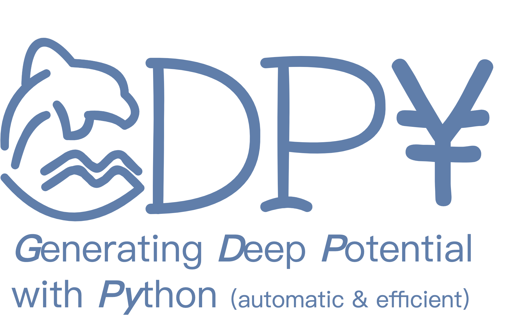
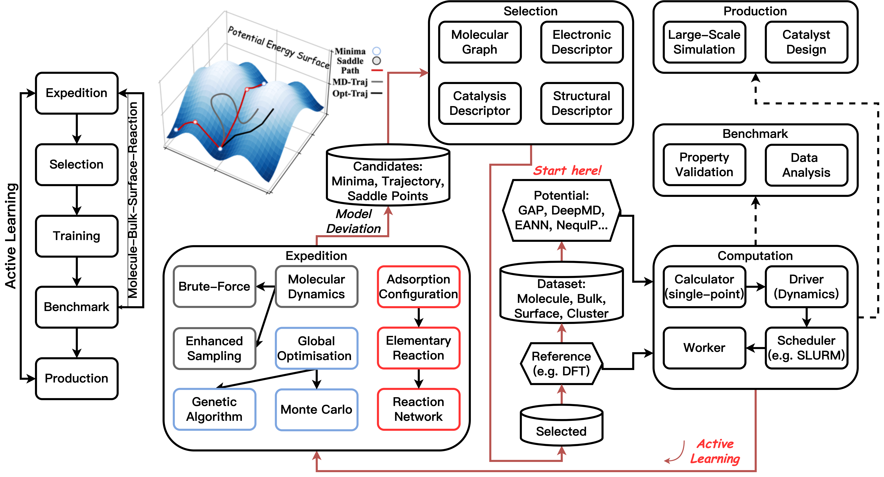

<p align="center">
  
</p>

<font size=36>**NOTE: This package has been renamed as `gdpx` from `GDPy` as we found, unfortunately, the name of `gdpy` has been taken for a long time. The `x` instead of `y` can be seen as an extended and improved version of the original one. The development of `gdpx` will still be undergoing in this `GDPy` repository. Also, the documentation is changed to https://gdpx.readthedocs.io.**</font>

<font size=36>**NOTE: `gdpx` is under active development and has not been released. The APIs are frequently changed and we cannot ensure any 
  backward compatibility.**</font>

# Install

`gdpx` is a pure python package. Since it does not include any codes that actually perform calculations and training, for example, `VASP` and `DEEPMD`, you should install them by yourselves.

## Latest Version
```
$ python -m pip install git+https://github.com/hsulab/GDPy.git
```

## Stable Release
```
$ conda install gdpx -c conda-forge
```

# Table of Contents

- [Overview](#overview)
- [Features](#features)
- [Architecture](#architecture)
- [Modules](#modules)
- [Authors](#authors)
- [License](#license)

# Overview
**Documentation**: https://gdpx.readthedocs.io (Changed from gdpyx)

GDPy stands for Generating Deep Potential with Python (GDPy/GDP¥), including a set of tools and Python modules to automate the structure exploration and the training for machine learning interatomic potentials (MLIPs).

It mainly focuses on the applications in heterogeneous catalysis. The target systems are metal oxides, supported clusters, and solid-liquid interfaces.

# Features
- A unified interface to various MLIPs.
- A graph-and-node session to construct user-defined workflows.
- Versatile exploration algorithms to construct a general dataset.
- Automation workflows for dataset construction and MLIP training.

# Architecture
<p align="center">
  
</p>

# Modules

## Potential
We do not implement any MLIP but offers a unified interface to access. Certain MLIP could not be utilised before corresponding required packages are 
installed correctly.The calculations are performed by **ase** ``calculators`` using either **python** built-in codes (PyTorch, TensorFlow) 
or File-IO based external codes (e.g. **lammps**).

**Supported MLIPs:**

| MLIPs                                                | Representation                        | Regressor    | Implemented Backend    |
| ---------------------------------------------------- | ------------------------------------- | ------------ | ---------------------- |
| [eann](https://github.com/zhangylch/EANN)            | (Rescursive) Embedded Atom Descriptor | NN/PyTorch   | ASE/Python, ASE/LAMMPS |
| [deepmd](https://github.com/deepmodeling/deepmd-kit) | Deep Potential Descriptors            | NN/Tensorflow| ASE/Python, ASE/LAMMPS | 
| [lasp](http://www.lasphub.com/#/lasp/laspHome)       | Atom-Centered Symmetry Functions      | NN/LASP      | ASE/LASP               |
| [nequip](https://github.com/mir-group/nequip)        | E(3)-Equivalent Message Passing       | NN/PyTorch   | ASE/Python, ASE/LAMMPS |

*NOTE: We use a modified eann package to train and utilise.*

*NOTE: Allegro is supported as well through the nequip manager.*

**Other Potentials:**
Some potentials besides MLIPs are supported. Force fields or semi-empirical potentials are used for pre-sampling to build an initial dataset. 
*Ab-initio* methods are used to label structures with target properties (e.g. total energy, forces, and stresses).

| Name.       | Description                          | Backend | Notes             |
| ----------- | ------------------------------------ | ------- | ----------------- |
| reax        | Reactive Force Field                 | LAMMPS  |                   |
| xtb         | Tight Binding                        | xtb     | Under development |
| VASP        | Plane-Wave Density Functional Theory | VASP    |                   |
| CP2K        | Density Functional Theory            | CP2K    |                   |

## Expedition
We take advantage of codes in well-established packages (ASE and LAMMPS) to perform basic minimisation and dynamics. Meanwhile, we have implemented several complicated alogirthms in GDPy itself.
| Name                                       | Current Algorithm                          | Backend     |
| ------------------------------------------ | ------------------------------------------ | ----------- |
| Molecular Dynamics (md)                    | Brute-Force/Biased Dynamics                | ASE, LAMMPS |
| Evolutionary Global Optimisation (evo)     | Genetic Algorithm                          | ASE/GDPy    |
| Basin Hopping                              | Monte Carlo like Global Optimisation       | GDPy        |
| Adsorbate Configuration (ads)              | Adsorbate Configuration Graph Search       | GDPy        |
| Reaction Event Exploration (rxn)           | Artificial Force Induced Reaction (AFIR)   | GDPy        |
| Grand Cononical Monte Carlo (gcmc)         | Monte Carlo with Variable Composition      | GDPy        |

## Workflow
There are two kinds of workflows according to the way they couple the expedition and the training. Offline workflow as the major category separates the expedition and the training, which collects structures from several expeditions and then trains the MLIP with the collective dataset. This process is highly parallelised and is usually aimed at a general dataset. Online workflow, a really popular one, adopts an on-the-fly strategy to build a dataset during the expedition, where a new MLIP is trained to continue exploration once new candidates are selected (sometimes only one structure every time!). Thus, it is mostly used to train an MLIP for a particular system.

| Type    | Supported Expedition |
| ------- | -------------------- |
| Offline | md, evo, ads, rxn    |
| Online  | md                   |

# Authors

[Jiayan Xu](https://scholar.google.com/citations?user=ue5SBQMAAAAJ&hl=en) (jxu15@qub.ac.uk)

under the supervision of [Prof. P. Hu](https://scholar.google.com/citations?user=GNuXfeQAAAAJ&hl=en) at Queen's University Belfast.

# License
GDPy project is under the GPL-3.0 license.
