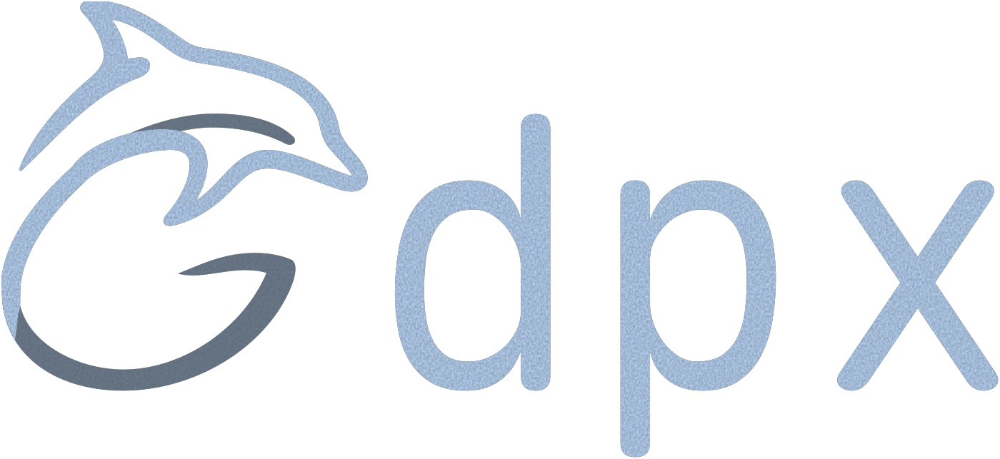

<p align="center">
  
</p>


## Scope

GDPy builds MLIP-driven workflows for atomistic simulation using advanced and
newly developed structure-exploration methods. It integrates sampling, dataset
construction, and model training into adaptive workflows.

**Focused systems**, with an emphasis on heterogeneous catalysis:

- metal oxides
- supported clusters
- disorder and amorphous surfaces
- solid–liquid interfaces

**Highlighted methods:**

- molecular dynamics (accelerated dynamics and enhanced sampling)
- monte carlo (canonical, semi-grand canonical, and grand canonical)
- global optimisation (structures, and reactions)

## Install

The package name is **gdpx**.

Install the nightly version from Git:

```shell
python -m pip install git+https://github.com/hsulab/GDPy.git
```

Install a release with conda:

```shell
conda install gdpx -c conda-forge
```

## Authors

- [Jiayan Xu](https://scholar.google.com/citations?user=ue5SBQMAAAAJ&hl=en)
  (jxu15@qub.ac.uk)
- [Prof. P. Hu](https://scholar.google.com/citations?user=GNuXfeQAAAAJ&hl=en)
  (supervisor, Queen's University Belfast)

## License

[GPL-3.0](LICENSE).
