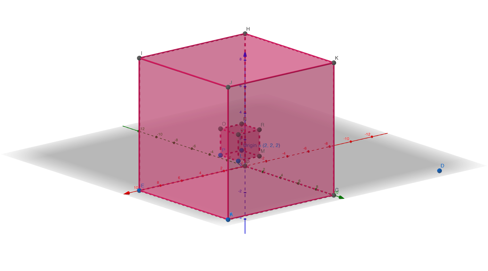
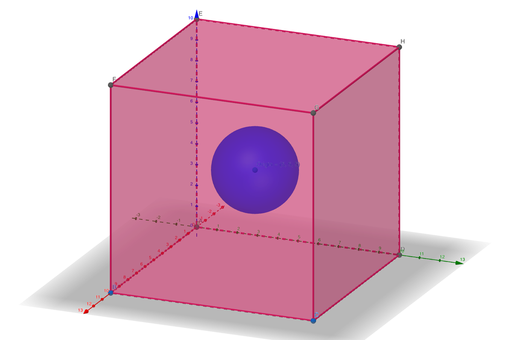
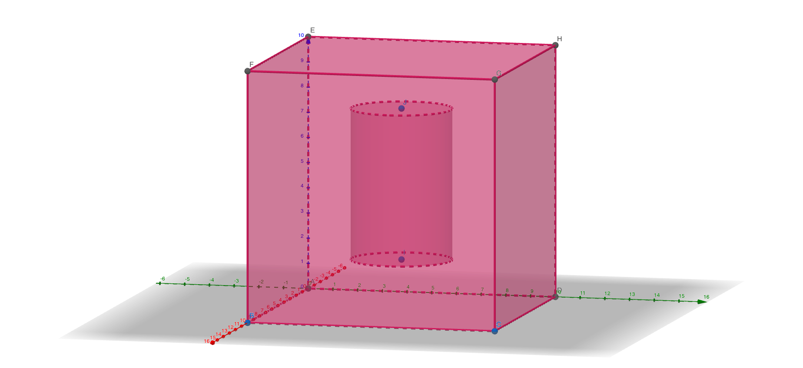
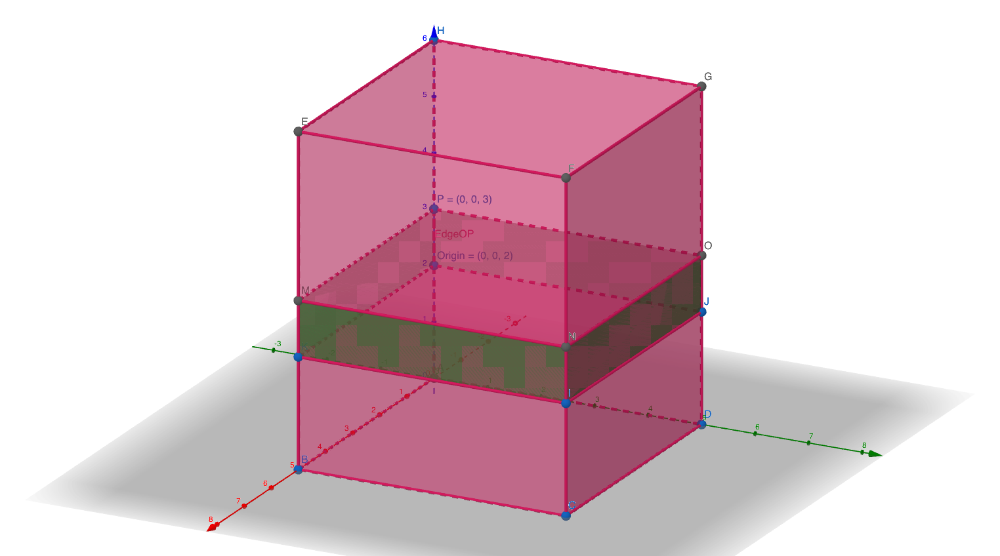

.. _Region Definitions:

Regions
=======

A region is a space defined in the Cartesian coordinate system, which help operators 
access and modify atoms in a much easier way. See its application in :ref:`Monte Carlo`. 

Define a region in the `yaml` input file as follows (units: Ang): 

- `auto`.

    This region takes the simulation box of the input atoms.

.. code-block:: yaml

    region:
      method: auto

- `cube`.

.. code-block:: yaml

    # Create a cube as ox+xl <= x <= ox+xh, oy+yl <= y <= oy+yh, oz+zl <= z <= oz+zh
    region:
      method: cube
      origin: [50, 50, 50] # ox, oy, oz
      boundary: [0, 0, 0, 10, 10, 10] # xl, yl, zl, xh, yh, zh

  

    
The figure shows a cubic region in a (10x10x10) simulation box. The origin is (2,2,2) 
and the boundary is [0,0,0,2,2,2].

    |cube|

- `sphere`.

.. code-block:: yaml

    # Create a sphere centre at [50, 50, 50] with the radius 50.
    region:
      method: sphere
      origin: [50, 50, 50]
      radius: 50

The figure shows a spherical region in a (10x10x10) simulation box. The origin is (5,5,5) 
and the radius is 2.

    |sphere|

- `cylinder`.

.. code-block:: yaml

    # Create a vertical cylinder.
    region:
      method: cylinder
      origin: [50, 50, 50]
      radius: 50
      height: 20

The figure shows a vertical cylinderal region in a (10x10x10) simulation box. 
The origin is (5,5,2), the radius is 2, and the height is 6.

    |cylinder|

- `lattice`.

.. code-block:: yaml

    # Create a periodic cubic lattice that is centred at [50, 50, 50].
    region:
      method: lattice
      origin: [50, 50, 50]
      cell: [10, 0, 0, 0, 10, 0, 0, 0, 10]

The figure shows a lattice region in a (10x10x10) simulation box. The origin is (0,0,2) 
and the cell is [10,0,0,0,10,0,0,0,2]. This is useful when only considering surface atoms.
Periodic boundary condition is used for this region.

    |lattice|
