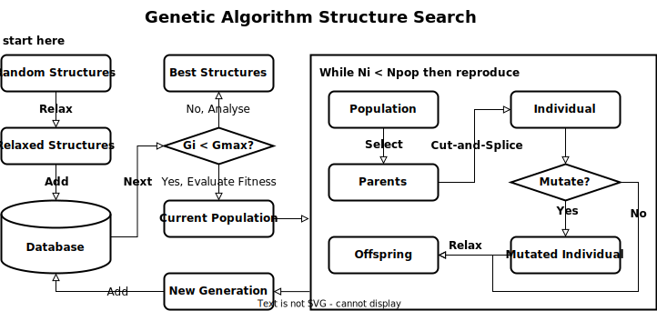
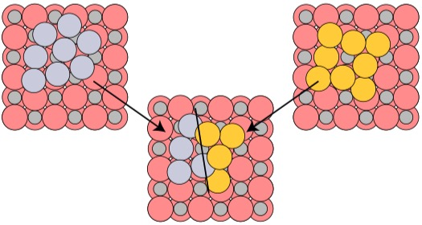

.. _Genetic Algorithm:

Genetic Algorithm (GA)
======================

Overview
--------

Genetic algorithm is a popular global optimisation method to find stable structures. 
GA in gdpy makes use of functionalities in ``ase`` package and provides a user-friendly 
interface by YAML.

The workflow of a GA-based global optimisation is

    |ga|

The steps are

#. Initial Population

    * Generate an initial population of structures.

    * Relax initial structures.

#. Iterate population until convergence.

    * **Selection**: Choose the best-*N* structures to form a new population.

    * **Crossover**: Use CutAndSplicePairing method to generate a new structure from two structures.
      This is critical to the success of GA. See the schema below. (Phys. Rev. Lett. 2012, 108, 126101.)

        |CutAndSplice|

    * **Mutation**: Each new structure (offspring) has a possibility to mutate that part of structures
      are modified.

    * **Minimisation**: Relax new structures.

    * **Convergence**: If the maximum number of generations (iterations) reaches.

#. Anaylse structures.

    * Find structures with target properties in all explored structures.

Example
-------

To use GA, the related commands are 

.. code-block:: shell

    # - explore configuration space defined by `config.yaml` 
    #   results will be written to the `results` folder
    #   a log file will be written to `results/gdp.out` as well
    $ gdp -d exp -p worker.yaml explore ./config.yaml

    # - after GA is converged i.e. reaches the maximum generation,
    #   all found minima will be saved to `./resuslts/results/all_candidates.xyz`

The GA input file `./config.yaml` contains several sections:

* method: This must be `genetic_algorithm`.

* builder: 
  
    Define the builder that generates random structures. This is used to generate 
    an initial population of structures. See :ref:`random builders` for more details. 
    The example builder will put 4 Cu atoms on the substrate stored in the file 
    `./sub.xyz`. Cu atoms are randomly created in a `lattice region`, details of which 
    can be found in :ref:`region definitions`. More specific, Cu atoms will have 
    arbitrary x- and y-coordiantes but z-coordinate within the range [7,7+6].
  
In the `params` section,

* database: All explored structures are stored in this file with suffix `.db`.

* property: Target property to minimise. (Only `energy` for now.)

* convergence: Convergence criteria, e.g., the maximum number of generation.

* population: Define how to organise a popultion.

    * init: 

        Number of structures (`size`) in the initial generation. These structures will be 
        created by the method defined in the `builder` section.

    * gen: 

        Number of structures in the following generation. `size` is the total 
        number. `random` is the number of structures generated by the initial
        builder while the rest is generated by the crossover operator.
    
    * pmut:

        The probability for each reproduced structure to mutate. 

* operators:

    * comparator:
    
        Explored structures are compared with each other. The probability of a structure 
        to be selected as a parent is inverse of the number of its similiar structures.
    
    * crossover:

        This is the most critical operator in GA. 
    
    * mutation: List of mutation operators.

        Each operator can be selected based on relative probabilities.

.. code-block:: yaml

  method: genetic_algorithm
  builder:
    method: random_surface
    composition:
      Cu: 4
    region:
      method: lattice
      origin: [0., 0., 7.]
      cell: [11.174, 0., 0., 0., 8.413, 0., 0., 0., 6.]
    substrates: ./sub.xyz
    covalent_ratio: [0.8, 2.0]
    random_seed: 127
  params:
    database: mydb.db
    population:
      init:
        size: 5
      gen:
        size: 5
        random: 2
      pmut: 0.8
    operators:
      comparator:
        dE: 0.015
        method: interatomic_distance
      crossover:
        method: cut_and_splice
      mutation:
      - method: rattle
        prob: 1.0
      - method: mirror
        prob: 1.0
    property:
      target: energy
    convergence:
      generation: 2
  
    
Application
-----------

.. include:: ../references.rst

#. |JPCC2022Xu|
#. |ACSCatal2022Xu|
#. |ACSCatal2023Han|
