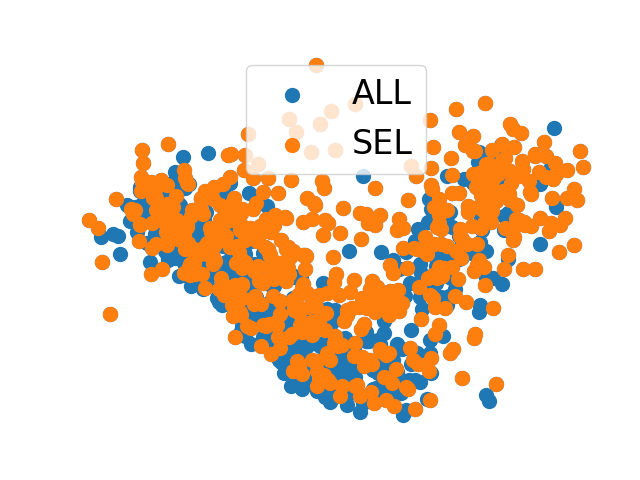

Descriptor
==========

`Select structures based on descriptors.` 

Two sparsification methods are supported.

- cur:

    Run CUR decomposition to select the most representative structures. This method 
    computes a CUR score for every structure and `strategy` defines the selection 
    either performs a deterministic selection (`descent`), structures with the `number` largest scores, 
    or a random one (`stochastic`), structures with higher scores that have higher probability. 
    If `zeta` is larger than 0., the input descripters will be transformed as 
    `MATMUL(descriptors.T, descriptors)^zeta`.

- fps:

    The farthest point sampling strategy. `min_distance` can be set to adjust the 
    sparsity of selected structures in the feature (descriptor) space.

.. code-block:: yaml

    selection:
        - method: descriptor
        descriptor:
            name: soap
            species: ["H", "O", "Pt"]
            rcut : 6.0
            nmax : 12
            lmax : 8
            sigma : 0.3
            average : inner
            periodic : true
        sparsify:
            method: cur # fps
            zeta: -1
            strategy: descent
        number: [16, 1.0]

This selection will produce a picture to visualise the distribution of structures.

    |dscribe|

.. note:: 

    This requires the python package `dscribe` to be installed. Use `pip install` or 
    `conda install dscribe -c conda-forge`.
