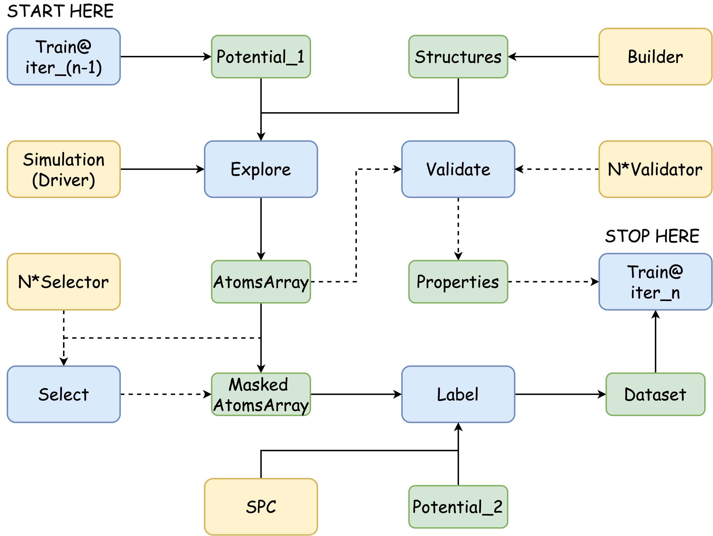

Compute+Select
==============

We can run basic computations with the operation `compute`. This operation accepts 
two input variables and one extra parameter and forwards `a List of Workers` that have 
computation results (several MD/MIN trajectories). 

Two input variables,

- builder: A node (variable or operation) that forwards structures.
- worker: Any `computer` variable.

One parameter,

- batchsize: How to allocate simulations into jobs.

The `computer` variable is almost the same as what we define in `worker.yaml` shown 
in :ref:`computations`. (Just change `potential` to `potter`...)

Taking `compute`'s output, we can use the 
`extract` operation to get the trajectories and use the `select` operation to select 
certain structures.

.. =====

The workflow defined in the configuration below looks like 

    |graph|

Sesscion Configuration
----------------------

This configuration runs MD simulations, select some structures for DFT single-point 
calculations, and transfer them to the dataset.

`read` , the `read_stru` operation reads structures from the file, which is basically a wrapper 
of the `ase.io.read` function. The `./candidates.xyz` contains five structures.

`scan`, the `compute` operation, accepts **${op:read}** as input structures and runs 
simulations defined in **${vx:dpmd_computation}**. In fact, `builder` can be any 
variable or operation that forwards structures, which, for instance, are from 
builders in Section :ref:`Builders` or the extract/select by other explorations. 
Meanwhile, `temp` in the `driver` variable is `[150, 300, 600, 1200, 1500]`. There 
will be FIVE workers that run MD simulations at different temperatures.

`extract`, the `extract` operation, reads the trajectories by `scan` and forwards 
an **AtomsArray** with a shape of (5, 5, 1000). The dimensions are `number of workers`, 
`number of input structures`, `the length of trajectory`.

`select_devi`, the `select` operation, uses a `property` selector to select structures 
with `max_devi_f` in the range of [0.08, 0.64] eV/Ang (NOTE: The potential used should 
support uncertainty quantification.)

`select_desc`, the `select` operation, usese a `descriptor` selector to select structures 
using `fps` (Farthest-Point Sampling) in the `soap`-based feature space. The selection is 
performed on the dimension (axis) 0, which means structures from different temperatures 
will be selected separately. Each group gets 64 structures and 320 (64*5) structures are 
selected in total.

`run_vasp`, another `compute` operation, takes the output of `select_desc` and perform 
the single-point DFT calculations.

`transfer`, the `transfer` operation, transfers structures calculated by DFT to a 
file `./dataset/${SESSION_NAME}-${COMPOSITION}-${SYSTEM}/${VERSION}.xyz`. If the 
input structures from `./candidates.xyz` all have a composition of Cu16. 
The stored xyz-file should be `./dataset/md-Cu16-surf/dpmd.xyz`

.. code-block:: yaml
    :emphasize-lines: 28

    variables:
      dataset:
        type: dataset
        name: xyz
        dataset_path: ./dataset
      # --- computers (workers)
      dpmd_computation:
        type: computer
        potter: ${vx:dpmd}
        driver: ${vx:nvtmd}
        scheduler: ${vx:scheduler_gpu1_dpmd}
      dpmd:
        type: potter
        name: deepmd
        params:
          backend: lammps
          command: lmp -in in.lammps 2>&1 > lmp.out
          type_list: ["Al", "Cu", "O"]
          model:
            - ./graph-0.pb
            - ./graph-1.pb
      nvtmd:
        type: driver
        task: md
        init:
          md_style: nvt
          timestep: 2.0
          temp: [150, 300, 600, 1200, 1500]
          dump_period: 10
          neighbor: "2.0 bin"
          neigh_modify: "every 10 check yes"
        run:
          steps: 10000
          constraint: "lowest 120"
      scheduler_gpu1_dpmd:
        type: scheduler
        backend: slurm
        ntasks: 1
        cpus-per-task: 1
        gres: gpu:1
        mem-per-cpu: 8G
        time: "0:30:00"
        environs: "export OMP_NUM_THREADS=1\nexport KMP_WARNINGS=0\nconda activate deepmd\n"
      vasp_computation:
        type: computer
        potter: ${vx:vasp_gam}
        driver: ${vx:driver_spc}
        scheduler: ${vx:scheduler_cpu64_vasp}
      vasp_gam:
        type: potter
        name: vasp
        params:
          backend: vasp
          command: srun vasp_gam 2>&1 > vasp.out
          incar: ./INCAR_LABEL_NoMAG
          kpts: 25
          pp_path: /home/apps/vasp/potpaw/recommend
          vdw_path: /home/apps/vasp/potpaw
      driver_spc:
        type: driver
        ignore_convergence: true
      scheduler_cpu64_vasp:
        type: scheduler
        backend: slurm
        ntasks: 64
        cpus-per-task: 1
        mem-per-cpu: 256M
        time: "24:00:00"
        environs: "export OMP_NUM_THREADS=1\nmodule purge\nmodule load intel/2021.1.2 intel-mpi/intel/2021.1.1\nconda activate deepmd\n"
      # --- selectors
      sift_desc:
        type: selector
        selection:
          - method: descriptor
            axis: 0
            descriptor:
              name: soap
              species: ["Al", "Cu", "O"]
              r_cut : 6.0
              n_max : 12
              l_max : 8
              sigma : 0.2
              average : inner
              periodic : true
            sparsify:
              method: fps
              min_distance: 0.1
            number: [64, 1.0]
      sift_devi:
        type: selector
        selection:
          - method: property
            properties:
              max_devi_f:
                range: [0.08, 0.64]
                nbins: 20
                sparsify: filter
    operations:
      read:
        type: read_stru
        fname: ./candidates.xyz
      scan:
        type: compute
        builder: ${op:read}
        worker: ${vx:dpmd_computation}
        batchsize: 256
      extract:
        type: extract
        compute: ${op:scan}
      select_devi:
        type: select
        structures: ${op:extract}
        selector: ${vx:sift_devi}
      select_soap:
        type: select
        structures: ${op:select_devi}
        selector: ${vx:sift_desc}
      run_vasp:
        type: compute
        builder: ${op:select_soap}
        worker: ${vx:vasp_computation}
        batchsize: 512
      extract_dft:
        type: extract
        compute: ${op:run_vasp}
      transfer:
        type: transfer
        structures: ${op:extract_dft}
        dataset: ${vx:dataset}
        version: dpmd
        system: surf
    sessions:
      md: transfer

.. warning::

    If the installed **dscribe** version is < 2.0.0, you need to change the parameters 
    `r_cut`, `n_max`, and `l_max` to `rcut`, `nmax`, and `lmax`.
