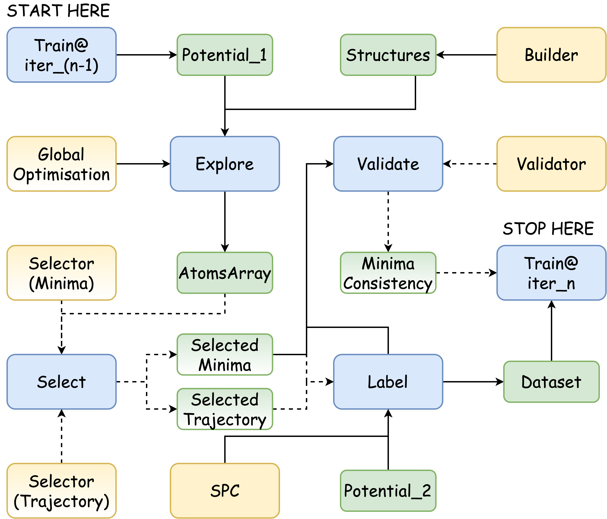

Explore with GA
===============

We can access the `expeditions` introduced in by `explore` operation. This operation 
accepts two input variables and forwards `a List of Workers` (several MD/MIN trajectories). 
Taking its output, we can further use `selectors` to select structures of interest and 
use `validators` to check if the potential gave us satisfactory results,

For the input variables,

- expedition: A variable with all expedition-related parameters.

- scheduler: Where to run the expedition.

.. =====

The workflow defined in the configuration below looks like 

    |graph|

Session Confiugration
---------------------

The definition of GA is similar to what we have in the :ref:`Genetic Algorithm`. The 
difference is that we use **{vx:builder}** and **{vx:computer}** in the `variables` 
section. The `worker` is the minimisation the same as the one we defined in `worker.yaml` 
that is no longer needed here.

After the exploration finishes, the `select` operation selects some structures from the 
output minimisation trajectories. In the configuration below, there are 20 trajectories 
in total, which is 5 structures in each generation times 4 generations (the initial generation 
plus 3 generations). Also, the `extract` operation sets `merge_worker` to true and thus forwards 
an AtomsArray with the shape of (20, ?), otherwise it is (4, 5, ?). The ? is the largest length of
the minimisation trajectory. 

`locate` selectors require two parameters:

- axis: The axis of the AtomsArray.
- indices: A string similar to python `slice`.

`select_minima` uses a `locate_minima` selector to first select the last structures of each trajectory 
and then takes 8 structures with the lowest total energies.

`select_mintraj` uses a `locate_mintraj` selector to select the structures of each trajectory with a 
step of `10`. If a trajectory has 27 structures, the structure at 0, 10, 20 steps will be selected.

With selected structures, one can further add the `compute` operation that label them with DFT or 
`validate` operation that analyses them.

The `seqrun` operation serves as an entry point of the worflow. It takes a list of nodes and will 
execute them sequentially.

.. code-block:: yaml
    :emphasize-lines: 10, 11, 15, 37, 47, 48

    variables:
      # --- Define the system to explore
      builder:
        type: builder
        method: random_surface
        composition:
          Cu: 19
        region:
          method: lattice
          origin: [0., 0., 7.]
          cell: [16.761, 0., 0., 0., 16.826, 0., 0., 0., 6.]
        substrates: ./surface.xyz
        # covalent_ratio: [0.8, 2.0]
        # test_too_far: false
        random_seed: 127 # Change this! 
                         # Otherwise, it will generate the same initial structures.
      # --- Define a potential to use
      computer:
        type: computer
        potter: ${vx:potter}
        driver: ${vx:driver_min}
        scheduler: ${vx:scheduler_loc}
      potter:
        type: potter
        name: deepmd
        params:
          backend: lammps
          command: lmp -in in.lammps 2>&1 > lmp.out
          type_list: ["Al", "Cu", "O"]
          model:
            - ./graph-0.pb
            - ./graph-1.pb
      driver_min:
        type: driver
        task: min
        backend: lammps
        ignore_convergence: true # Allow unconvgerd trajectory
        run:
          fmax: 0.05 # 0.1
          steps: 400
          constraint: "lowest 120"
      scheduler_loc:
        type: scheduler
      # --- Define the expedition (exploration)...
      ga:
        type: genetic_algorithm
        builder: ${vx:builder}
        worker: ${vx:computer}
        params:
          database: mydb.db # ase convert ./mydb.db mydb.xyz
          property:
            target: energy
          convergence:
            generation: 3
          population:
            init:
              size: 5
            gen:
              size: 5 # = init.size
              random: 1
            pmut: 0.8 # prob of mutation
          operators: # here, define a bunch of operators
            comparator:
              method: interatomic_distance
              dE: 0.015
            crossover: # reproduce
              method: cut_and_splice
            mutation:
              - method: rattle
                prob: 1.0
              - method: mirror
                prob: 1.0
      # --- Define some selectors...
      locate_minima:
        type: selector
        selection:
          - method: locate
            axis: 1
            indices: "-1"
          - method: property
            properties:
              energy:
                sparsify: sort
            number: [8, 1.0]
      locate_mintraj:
        type: selector
        selection:
          - method: locate
            axis: 1
            indices: ":-1:10"
    operations:
      # --- run exploration
      explore: # -> a List of workers
        type: explore # forward a list of workers
        expedition: ${vx:ga}
        scheduler: ${vx:scheduler_loc}
      # --- get minima
      extract: # -> trajectories with a shape of (20, ?)
        type: extract
        compute: ${op:explore}
        merge_workers: true
      select_minima: # -> minima
        type: select
        structures: ${op:extract}
        selector: ${vx:locate_minima}
      # --- get mintraj
      extract_mintraj: # -> trajectories with a shape of (20, ?)
        type: extract
        compute: ${op:explore}
        merge_workers: true
      select_mintraj: # -> minima
        type: select
        structures: ${op:extract_mintraj}
        selector: ${vx:locate_mintraj}
      seqrun:
        type: seqrun
        nodes:
          - ${op:select_minima}
          - ${op:select_mintraj}
    sessions:
      _ga: seqrun

.. note:: 

    Since initial structures are randomly created, they may have very small atomic 
    distances. The minimisation may not converged even after hundreds of steps. Set 
    **ignore_convergence** in the **driver** to allow the unconverged trajectory. The 
    LAST structure in the trajectory will be accepted by GA to reproduce structures in 
    the following generations.
